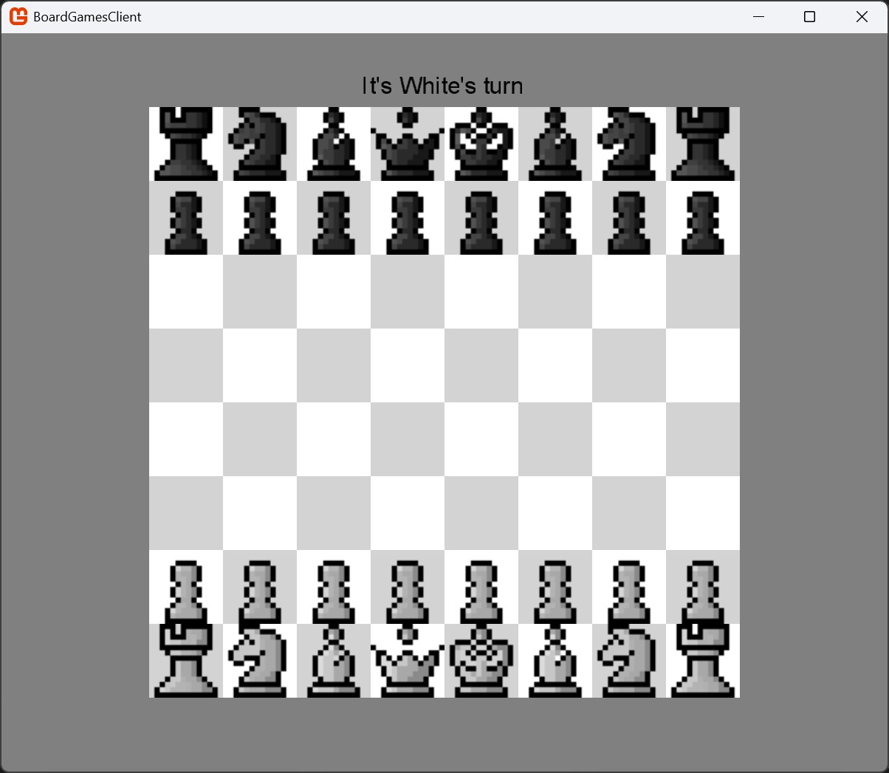
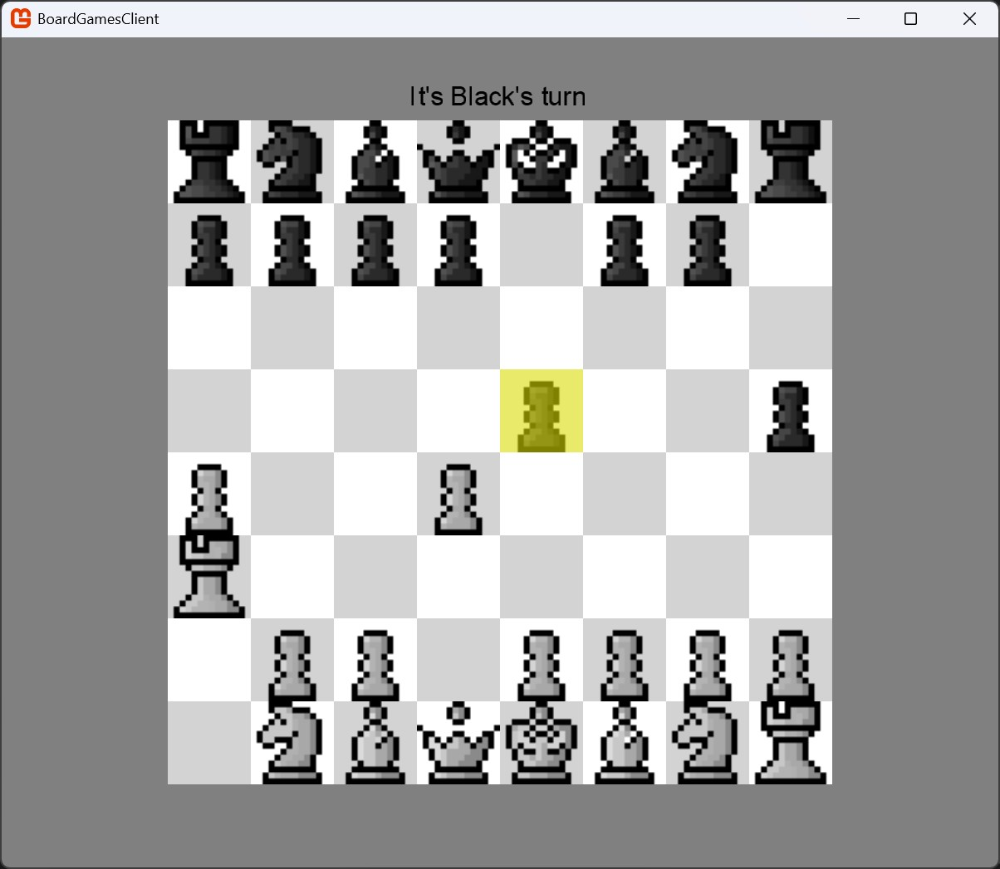
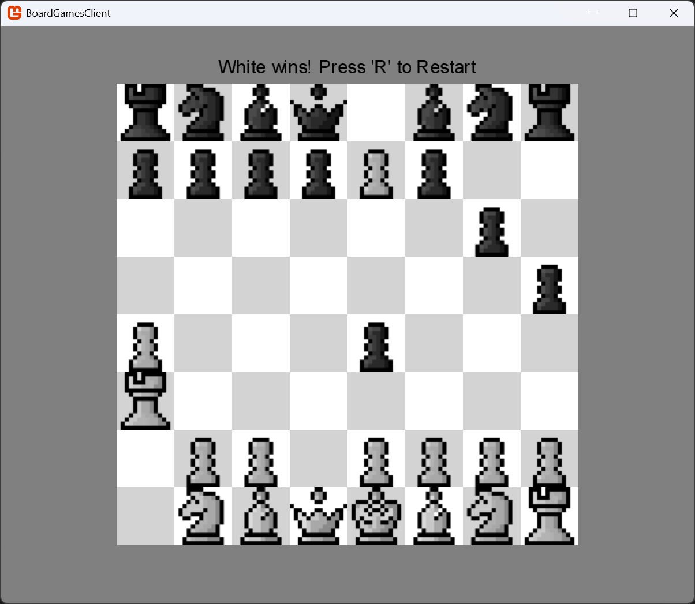

**Chess (Singleplayer)**

---

Selecting `Play Chess` will launch [`Chess.cs`](../../BoardGames/BoardGamesClient/Chess.cs), the Singleplayer Version of Chess (shared Board).

---

`Initial Board`

`Gameplay with selected Piece`

`Simplified Game Over (King is captured)`

---

- [Main Page](../Pages/ENTRY.md)
- [Entry Point](./ENTRY.md)
- Chess (Singleplayer) (Current Page)
- [Tic Tac Toe (Singleplayer)](./TTT.md)
- [Chess (Multiplayer)](.CHESSMP.md)
- [Tic Tac Toe (Multiplayer)](./TTTMP.md)

---

- [Repository](../../)

---