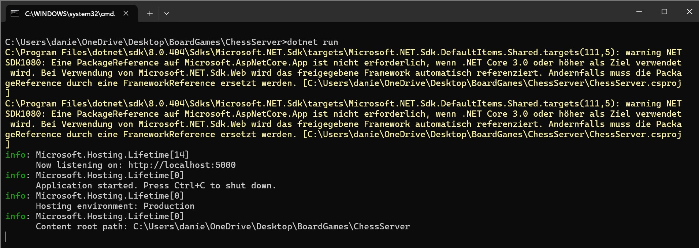

**Tic Tac Toe (Multiplayer)**

---

First, the `ChessServer` has to be launched (the Server's [`Program.cs`](../../BoardGames/ChessServer/Program.cs)) using `dotnet run`.\
Two Clients then each run their own Game by selecting
`Chess (Multiplayer)`. \
This will launch [`ChessOnline.cs`](../../BoardGames/BoardGamesClient/ChessOnline.cs) for both Clients.

> Unfortunately, this does not work. Due to our Problems with Tic Tac Toe Multiplayer we didn't have Time to work on Chess Multiplayer. The Server Basics have been implemented but not the Game Loop.

---

`Server Startup`

---

- [Main Page](../Pages/ENTRY.md)
- [Entry Point](./ENTRY.md)
- [Chess (Singleplayer)](./CHESS.md)
- [Tic Tac Toe (Singleplayer)](./TTT.md)
- Chess (Multiplayer) (Current Page)
- [Tic Tac Toe (Multiplayer)](./TTTMP.md)

---

- [Repository](../../)

---
