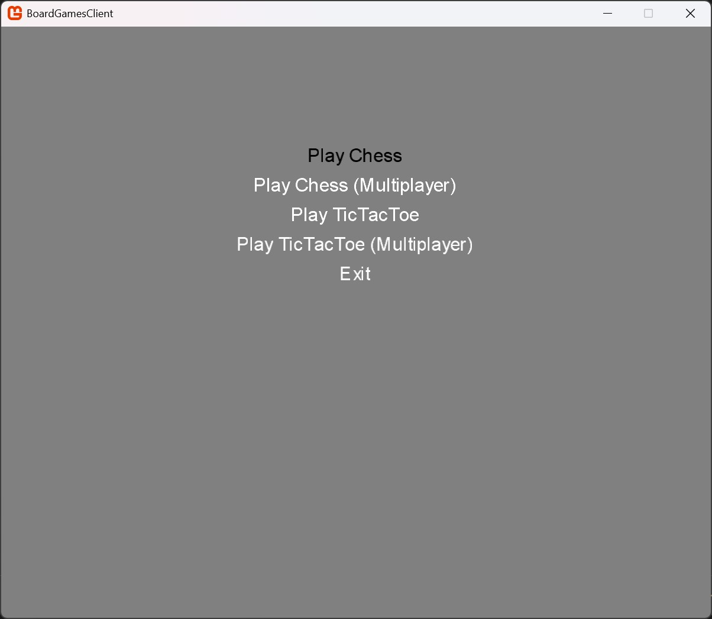

**Entry Point**

---

The Game can be launched via
- `dotnet run` (may lead to Problems due to the Content Pipeline)
- [`BoardGamesClient.exe`](../../BoardGames/BoardGamesClient/bin/Debug/net8.0/)

This launches the [`Program.cs`](../../BoardGames/BoardGamesClient/Program.cs) which in turn launches the [`Game1.cs`](../../BoardGames/BoardGamesClient/Game1.cs), Monogame's main Game File.\
In our Project we use this as a Switch between the different Games.\
The Player can use the `Arrow Keys` and `Enter` to select a Game.

---

`Selection Window`

---

- [Main Page](../Pages/ENTRY.md)
- Entry Point (Current Page)
- [Chess (Singleplayer)](./CHESS.md)
- [Tic Tac Toe (Singleplayer)](./TTT.md)
- [Chess (Multiplayer)](.CHESSMP.md)
- [Tic Tac Toe (Multiplayer)](./TTTMP.md)

---

- [Repository](../../)

---