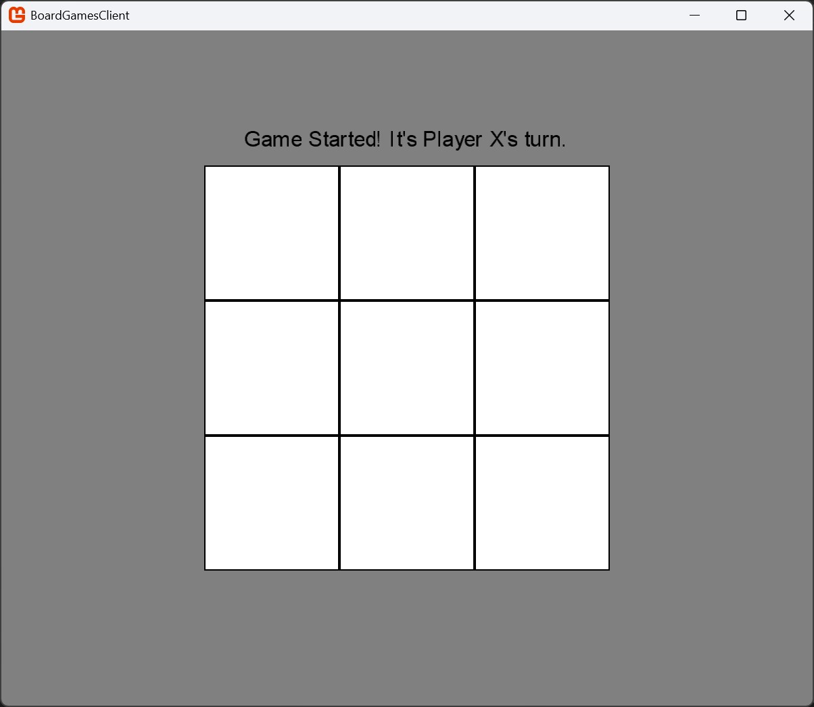
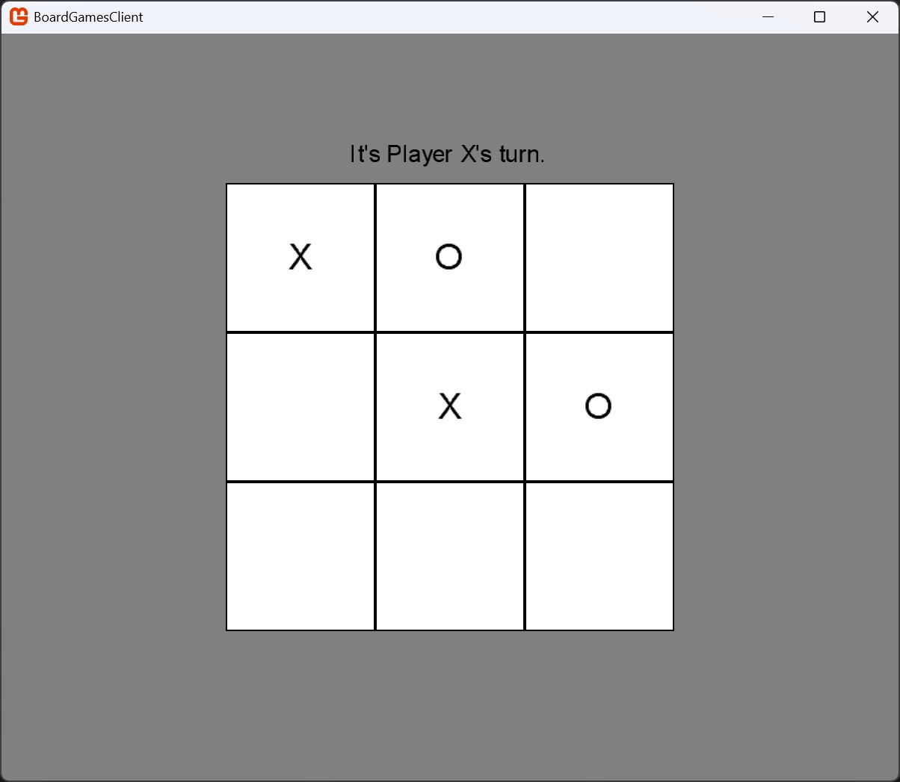
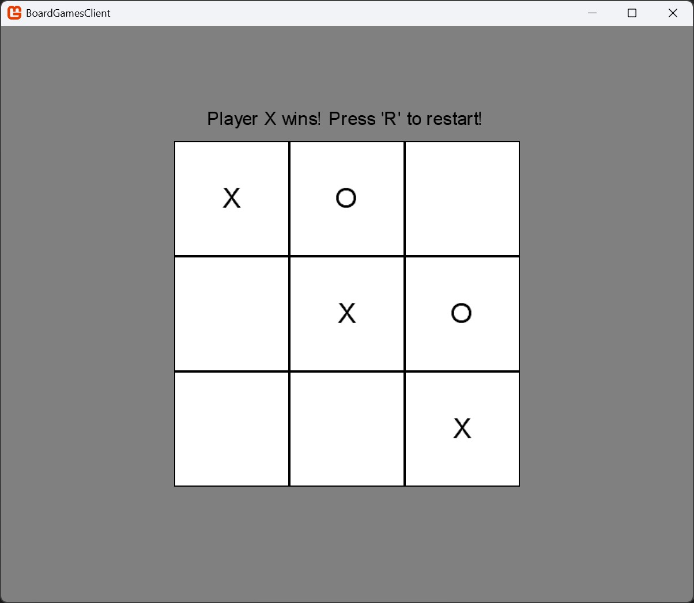

**Tic Tac Toe (Singleplayer)**

---

Selecting `Play Tic Tac Toe` will launch [`TicTacToe.cs`](../../BoardGames/BoardGamesClient/TicTacToe.cs), the Singleplayer Version of Tic Tac Toe (shared Board).

---

`Initial Board`

`Gameplay`

`Game Over`

---

- [Main Page](../Pages/ENTRY.md)
- [Entry Point](./ENTRY.md)
- [Chess (Singleplayer)](./CHESS.md)
- Tic Tac Toe (Singleplayer) (Current Page)
- [Chess (Multiplayer)](./CHESSMP.md)
- [Tic Tac Toe (Multiplayer)](./TTTMP.md)

---

- [Repository](../../)

---
