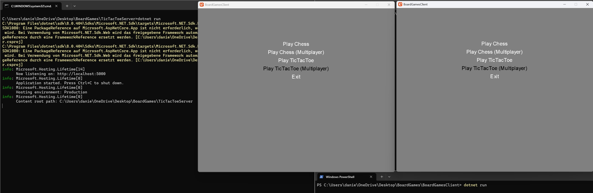
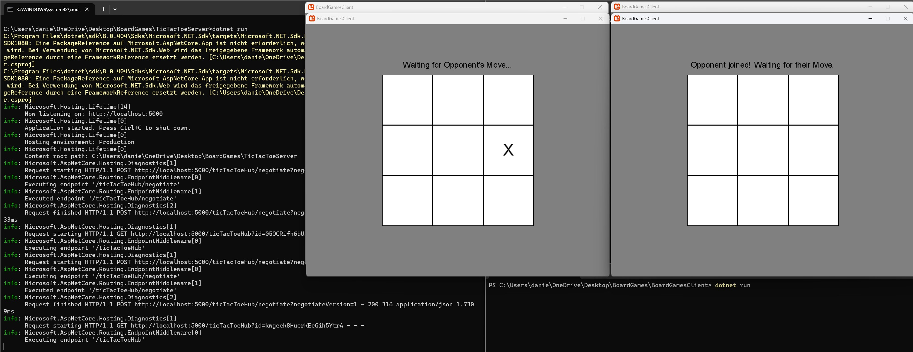

**Tic Tac Toe (Multiplayer)**

---

First, the `TicTacToeServer` has to be launched (the Server's [`Program.cs`](../../BoardGames/TicTacToeServer/Program.cs)) using `dotnet run`.\
Two Clients then each run their own Game by selecting
`Play Tic Tac Toe (Multiplayer)`. \
This will launch [`TicTacToeOnline.cs`](../../BoardGames/BoardGamesClient/TicTacToeOnline.cs) for both Clients.

> Unfortunately, this does not work. Both Clients can connect to the Server with the first Player being able to make a Move, but this is not correctly broadcasted.

---

`Server and Client Startup`

`Connection and first Move`

---

- [Main Page](../Pages/ENTRY.md)
- [Entry Point](./ENTRY.md)
- [Chess (Singleplayer)](./CHESS.md)
- [Tic Tac Toe (Singleplayer)](./TTT.md)
- [Chess (Multiplayer)](.CHESSMP.md)
- Tic Tac Toe (Multiplayer) (Current Page)

---

- [Repository](../../)

---