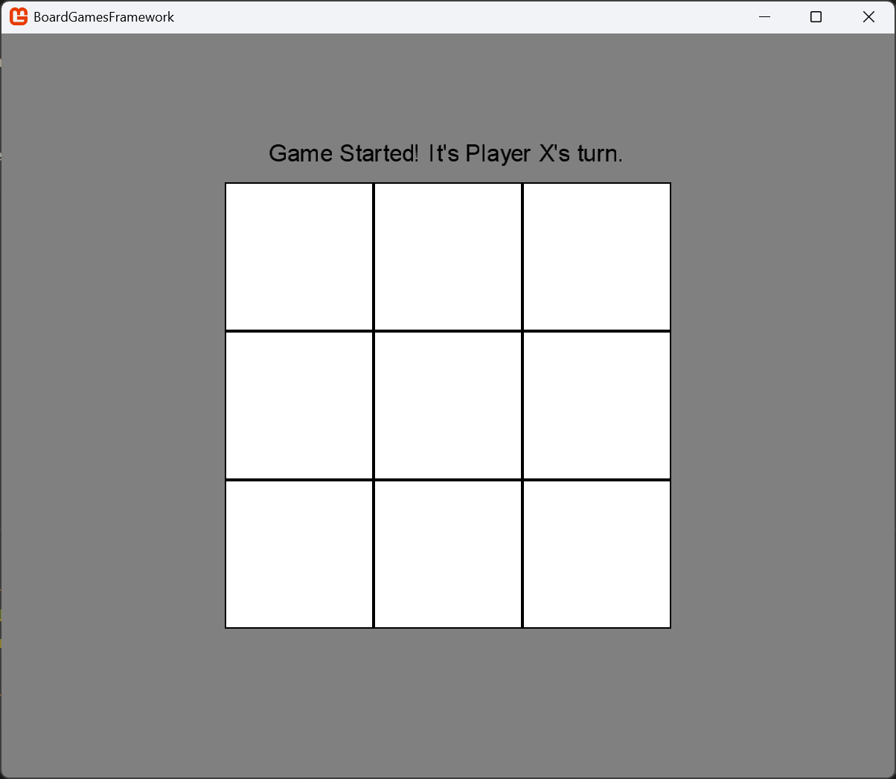
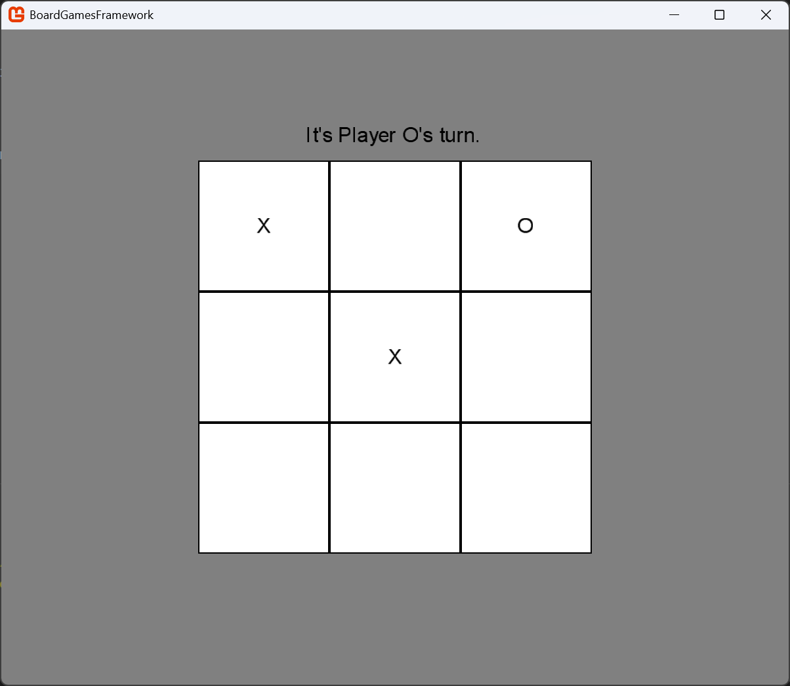
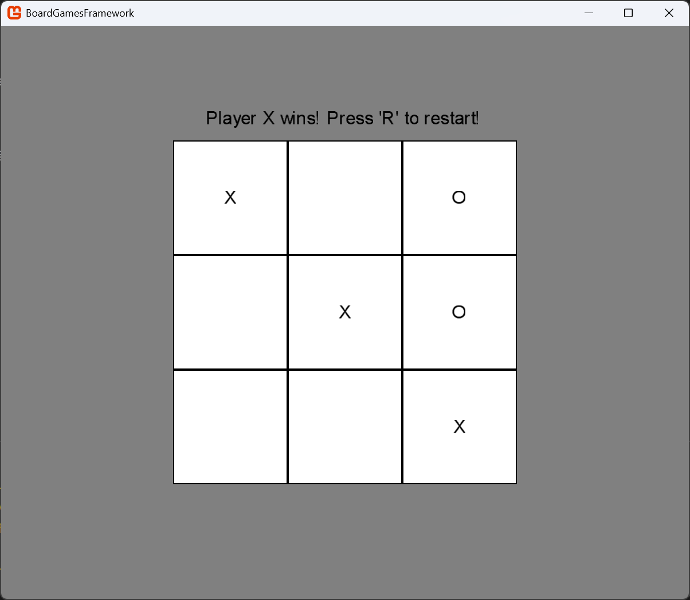
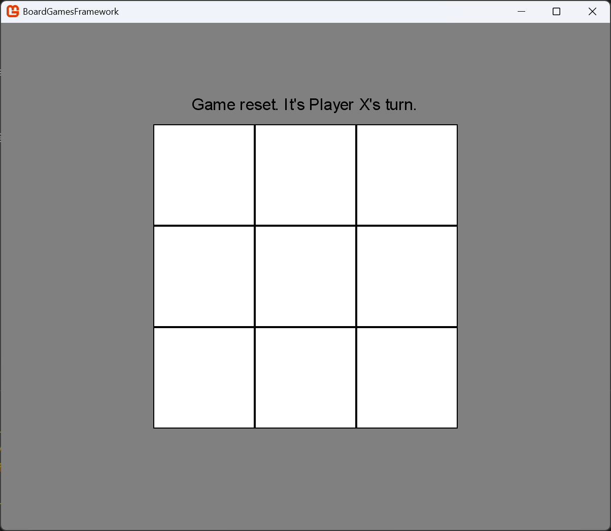
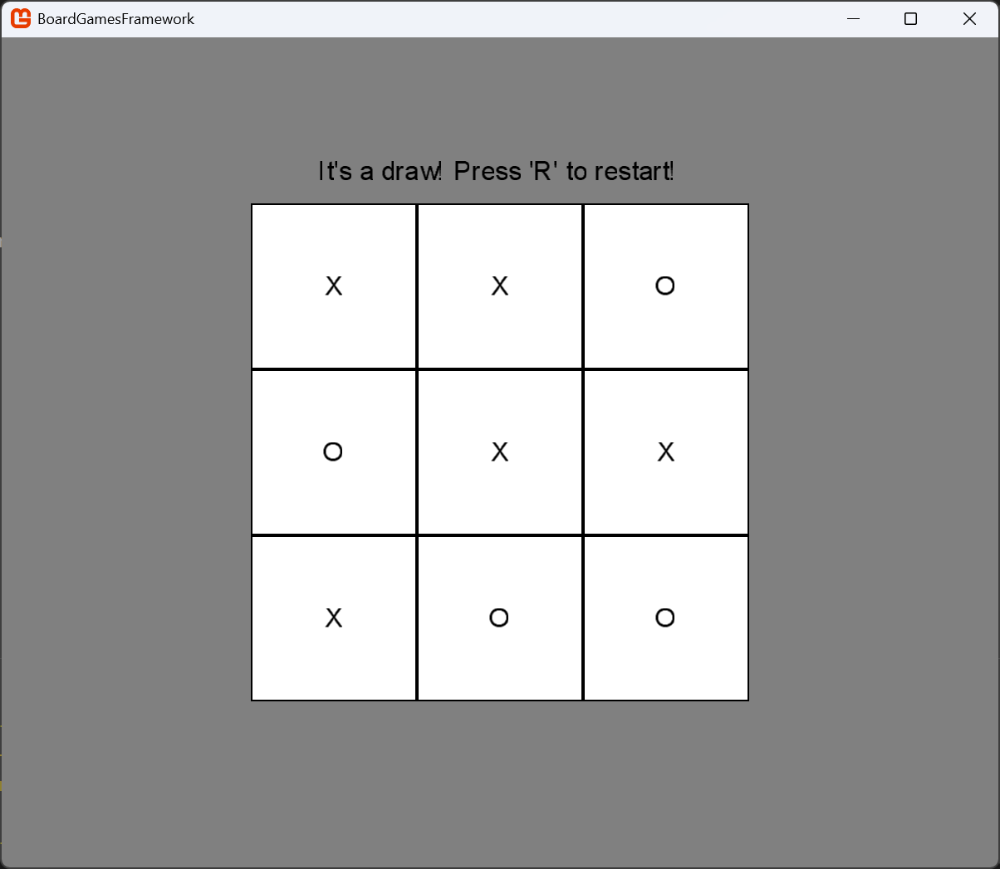

# Short description of the milestone #

## Work since the last Milestone ##
- Fixed problems with the project
  - Switched to Windows for Development (Problems on Mac)
- Implemented a simple Version of Tic Tac Toe using our Framework
    - Use Characters "X" and "O" as Pieces
    - Place Pieces with Mouseclick
    - Implement Win-/Draw-Condition and Reset
- Tested it as a local singleplayer Game (Game1.cs File)
    - Gametext updates (e.g. "Player O's turn.")
    - Enable Fullscreen/Maximizing Screen
    - Center Board/Text independent of Window Size

## Extended Project Structure ##
````
BoardGamesFramework/
└── src/
    ├── Framework/
    │   ├── GameEngine/                     
    │   │   ├── GameState.cs            # Abstract Class for Game state logic
    │   │   ├── Board.cs                # Abstract class for boards
    │   │   ├── Player.cs               # Player-related data
    │   │   ├── Move.cs                 # Abstract Class representing moves
    │   │   ├── IGame.cs                # Interface for Games
    │   │   ├── IGameManager.cs         # Interface for Game Manager
    │   │   └── Renderer.cs             # Handles rendering (not yet needed)
    │   └── Network/
    │       └── GameHub.cs              # SignalR
    ├── Games/                          # Implementations of our Games
    │   ├── TicTacToe/                  # TicTacToe Implementation
    │   │   ├── TicTacToeBoard.cs       
    │   │   ├── TicTacToeGame.cs        
    │   │   ├── TicTacToeGameManager.cs 
    │   │   ├── TicTacToeGameState.cs
    │   │   └── TicTacToeMove.cs
    │   └── Chess/                      # Chess Implementation
    ├── WebClient/                      # Web Client for Web-App 
    ├── Server/                         # Manage Game Sessions and Players 
    └── Game1.cs                        # Core Game Class for Project              
````

## Relevant Parts of the Code ##

```c#
public class TicTacToeBoard : Board
{
    ( ... )

    public TicTacToeBoard()
    {
        Rows = 3;
        Columns = 3;
        Cells = new string[Rows, Columns];
    }

    // Initialize empty Cells
    public override void Initialize() { ... }

    // Display the Board
    public override string Display() { ... }
}
```

```c#
public class TicTacToeGame : IGame
{
    ( ... )

    // Initialize a Tic Tac Toe Game
    public void Initialize() { ... }

    // Check if Move is valid (inside Board and empty Cell)
    public bool IsMoveValid(Move move) { ... }

    // Play a Move and if Win Condition not met switch Players
    public void PlayMove(Move move) { ... }
}
```

```c#
public class TicTacToeGameManager : IGameManager
{
    ( ... )

    // Generic Method to create a new TicTacToe game and returns its unique gameId
    public string CreateGame<TGame>() where TGame : IGame, new() { ... }

    // Retrieve a game instance by its gameId
    public IGame GetGame(string gameId) { ... }

    // Adds a player to an existing game by gameId
    public bool AddPlayer(string gameId, Player player) { ... }

    // Remove a Player from a Game (Player leaves)
    public bool RemovePlayer(string gameId, Player player) { ... }

    // Processes a player's move in a Game if it's valid
    public bool MakeMove(string gameId, Move move) { ... }

    // Checks if the game with the given gameId is over
    public bool IsGameOver(string gameId) { ... }

    // Retrieves the winner of a Game
    public Player GetWinner(string gameId) { ... }

    // Retrieves a list of active games (gameIds)
    public IEnumerable<string> GetActiveGames() { ... }

    // Resets Game (after end or reset)
    public void ResetGame(string gameId) { ... }
}
```

```c#
public class TicTacToeGameState : GameState
{
    ( ... )

    // Reset Game (Initialize Board and starting Player etc)
    public override void Reset() { ... }
        
    // Check for Win (Rows/Colums/Diagonals) or Draw
    public override bool CheckWinCondition() { ... }

    // Make a Move 
    public override bool MakeMove(Move move) { ... }

    // Switch between the two Players (X and O)
    public override void SwitchPlayer() { ... }
}
```

```c#
public class TicTacToeMove : Move
{
    public int Row { get; }
    public int Column { get; }

    // Place a Players Piece in intended Cell
    ( ... )
}
```

```c#
    public class Game1 : Game
    {
        ( ... )
        private Player _playerX, _playerO;
        private Texture2D _cellTexture;
        private SpriteFont _font;
        private int _cellSize = 200;


        public Game1() { ... }

        protected override void Initialize()
        {
            // Window Adjustments like Maximizing Window,
            // Centering the Board in the Window etc

            // Initialize GameManager
            _gameManager = new TicTacToeGameManager();

            // Create a new TicTacToe game
            _currentGameId = _gameManager.CreateGame<TicTacToeGame>();

            // Create two players
            _playerX = new Player("X", "Player X");
            _playerO = new Player("O", "Player O");

            // Add Players to the Game and display Game Text
            ( ... )
        }

        // Load Content (Textures, Fonts, etc)
        protected override void LoadContent() { ... }

        // Update Game (Game Text, Display Winner Name or Draw, etc)
        // Process Mouse Input
        protected override void Update(GameTime gameTime) { ... }

        // Draw Game (Board, Player Pieces, etc)
        protected override void Draw(GameTime gameTime) { ... }

        // Some Further Methods for Adjusting Design
        // Center Text, Center Board, Resize etc
        ( ... )
    }
```

## Screenshots of the Game ##
After launching the Game


While playing the Game


After a Player wins


After resetting the Game with 'R'\
The rematch is started by the Winner or 'X' in case of a draw


When the Game ends in a Draw


## Plans for Milestone 3 ##
- Implement Chess using Framework
- Create/Find Sprites for different Chess Pieces
- Fix Problems with GeonBit.UI Library
