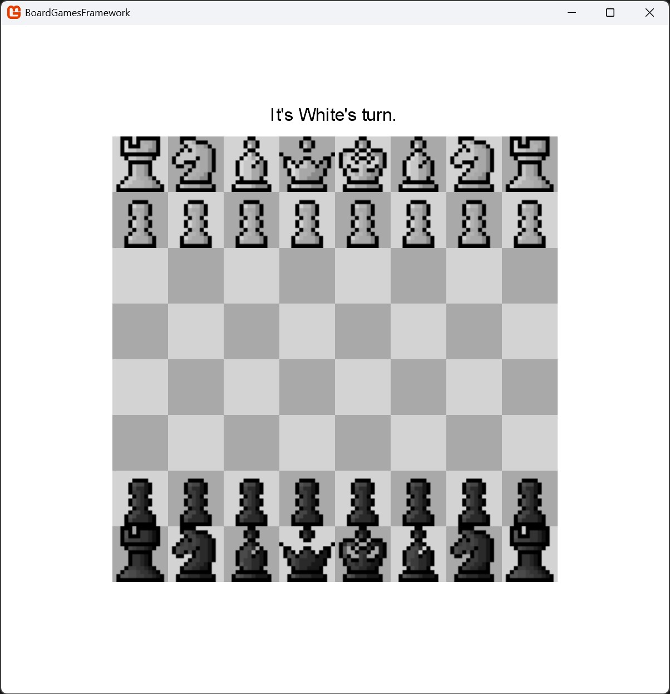
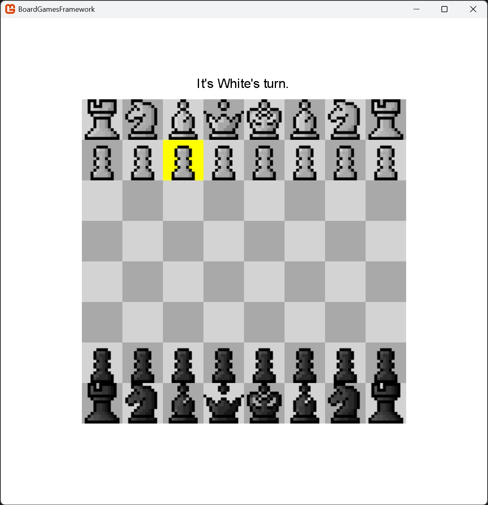

# Short description of the milestone #

## Work since the last Milestone ##
- Implemented Chess using our Framework
  - Testing different Sprites for Pieces
- Does not yet work
  - Running the Game with Board and Pieces set up
  - White can select a Piece (is highlighted)
  - No moves possible (Problem most likely in ChessMove or HandleMouseClick)

## Extended Project Structure ##
```
BoardGamesFramework/
└── src/
    ├── Framework/
    │   ├── GameEngine/                     
    │   │   ├── GameState.cs            # Abstract Class for Game state logic
    │   │   ├── Board.cs                # Abstract class for boards
    │   │   ├── Player.cs               # Player-related data
    │   │   ├── Move.cs                 # Abstract Class representing moves
    │   │   ├── IGame.cs                # Interface for Games
    │   │   ├── IGameManager.cs         # Interface for Game Manager
    │   │   └── Renderer.cs             # Handles rendering (not yet needed)
    │   └── Network/
    │       └── GameHub.cs              # SignalR
    ├── Games/                          # Implementations of our Games
    │   ├── TicTacToe/                  # TicTacToe Implementation
    │   │   ├── TicTacToeBoard.cs       
    │   │   ├── TicTacToeGame.cs        
    │   │   ├── TicTacToeGameManager.cs 
    │   │   ├── TicTacToeGameState.cs
    │   │   └── TicTacToeMove.cs
    │   └── Chess/                      # Chess Implementation
    │       ├── ChessBoard.cs
    │       ├── ChessGame.cs
    │       ├── ChessGameManager.cs
    │       ├── ChessGameState.cs
    │       └── ChessMove.cs
    ├── WebClient/                      # Web Client for Web-App 
    ├── Server/                         # Manage Game Sessions and Players 
    └── Game1.cs                        # Core Game Class for Project              
```

## Relevant Parts of the Code ##

```c#
public class ChessBoard : Board
{
    ( ... )

    public ChessBoard()
    {
        Rows = 8;
        Columns = 8;
        Cells = new string[Rows, Columns];
    }

    // Initialize empty Cells
    public override void Initialize()
    {
        // Initialize pieces for both players
        // P = Pawn         B = Bishop
        // R = Rook         Q = Queen
        // N = Knight       K = King
        string[] backRank = { "R", "N", "B", "Q", "K", "B", "N", "R" };

        // Player 1 (White)
        for (int col = 0; col < Columns; col++)
        {
            Cells[0, col] = "W" + backRank[col]; // Back rank
            Cells[1, col] = "WP";                // Pawns
        }

        // Same for Player 2 (Black)
        ( ... )

        // Empty cells (for rows between the two players)
        ( ... )
    }

    // Display the Board
    public override string Display() { ... }
}
```

```c#
public class ChessGame : IGame
{
    ( ... )

    // Initialize a Chess Game
    public void Initialize() { ... }

    // Check if Move is valid
    // For now only inside bounds
    // and cells with no pieces of current player
    public bool IsMoveValid(Move move) { ... }

    // Play a Move
    public void PlayMove(Move move) { ... }
}
```

```c#
public class ChessGameManager : IGameManager
{
    ( ... )

    // Generic Method to create a new Chess game and return its unique gameId
    public string CreateGame<TGame>() where TGame : IGame, new() { ... }

    // Retrieve a game instance by its gameId
    public IGame GetGame(string gameId) { ... }

    // Adds a player to an existing game by gameId
    public bool AddPlayer(string gameId, Player player) { ... }

    // Remove a Player from a Game (Player leaves)
    public bool RemovePlayer(string gameId, Player player) { ... }

    // Processes a player's move in a Game if it's valid
    public bool MakeMove(string gameId, Move move) { ... }

    // Checks if the game with the given gameId is over
    public bool IsGameOver(string gameId) { ... }

    // Retrieves the Winner of a Game
    public Player GetWinner(string gameId) { ... }

    // Retrieves a list of active games (gameIds)
    public IEnumerable<string> GetActiveGames() { ... }

    // Resets Game (after end or reset)
    public void ResetGame(string gameId) { ... }
}
```

```c#
public class ChessGameState : GameState
{
    ( ... )

    // Reset Game (Initialize Board, Pieces, etc)
    public override void Reset() { ... }
        
    // For now only checks if the King's are captured
    public override bool CheckWinCondition() { ... }

    // Make a Move from Starting Cell to End Cell
    public override bool MakeMove(Move move) { ... }

    // Switch between the two Players (White and Black)
    public override void SwitchPlayer() { ... }
}
```

```c#
public class ChessMove : Move
{
    // Chess Move with startPosition, endPosition and pieceType
    ( ... )
}
```

```c#
    public class Game1 : Game
    {
        ( ... )
        private Player _playerWhite, _playerBlack;
        private Dictionary<string, Texture2D> _pieceTextures;
        private Texture2D _cellTexture;
        private SpriteFont _font;
        private Vector2? _selectedCell; // Track selected piece/cell

        public Game1() { ... }

        // Initialize Game and Add Players
        protected override void Initialize() { ... }

        // Load Game Content
        protected override void LoadContent()
        {
            ( ... )

            _pieceTextures = new Dictionary<string, Texture2D>
            {
                { "WP", Content.Load<Texture2D>("WP") },
                { "WR", Content.Load<Texture2D>("WR") },
                { "WN", Content.Load<Texture2D>("WN") },
                { "WB", Content.Load<Texture2D>("WB") },
                { "WQ", Content.Load<Texture2D>("WQ") },
                { "WK", Content.Load<Texture2D>("WK") },
                { "BP", Content.Load<Texture2D>("BP") },
                { "BR", Content.Load<Texture2D>("BR") },
                { "BN", Content.Load<Texture2D>("BN") },
                { "BB", Content.Load<Texture2D>("BB") },
                { "BQ", Content.Load<Texture2D>("BQ") },
                { "BK", Content.Load<Texture2D>("BK") }
            };
        }

        // Update Game
        protected override void Update(GameTime gameTime) { ... }

        // Get Winner and Reset the Game if necessary
        private void HandleGameOver() { ... }

        // Handle Mouse Clicks
        // First Click selects Piece/Cell
        // Second Click selects Cell to move to
        private void HandleMouseClick() { ... }

        // Update the Game Text (Who's turn is it? Game Over etc.)
        private void UpdateGameStateText() { ... }

        // Draw Everything (Background, Board, Pieces, GameText)
        protected override void Draw(GameTime gameTime) { ... }

        // Draw the Board and Highlight selected Cell
        private void DrawBoard() { ... }

        // Draw Pieces depending on String
        private void DrawPieces() { ... }

        // Further Helper Methods for Visualization
        ( ... )
    }
```

## Screenshots of the Game ##
After launching the Game


Highlighting the selected Piece


## Plans for Milestone 4 ##
- Fix Chess Implementation
- Build Server/Client Structure (and run locally)
- Work on Design as much as possible
- Prepare for Presentation