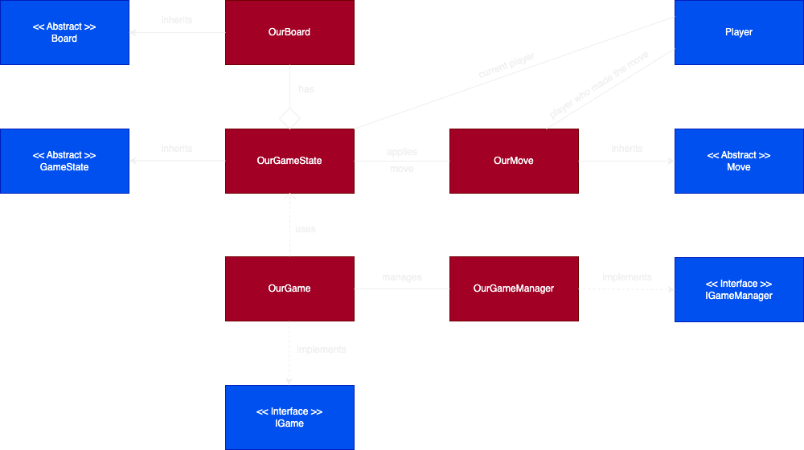

# Presentation (30.01.2025) #

Yoav Bachar und Daniel Krall
## Work since the last Milestone ##
- Fixed Chess Implementation
  - Board and Pieces set up
  - Moves possible
  - Game Over when King is captured

## Plans until Submission ##
- Client/Server System (and run locally)
- Work on Design (if possible)

## Software and Libraries ##
- [**MonoGame**](https://monogame.net/): .NET Framework for Game Development in C#
- [**ASP.NET Core**](https://dotnet.microsoft.com/en-us/learn/aspnet/blazor-tutorial/intro): Web-App Framework
- [**SignalR**](https://learn.microsoft.com/de-de/aspnet/core/tutorials/signalr?view=aspnetcore-8.0&WT.mc_id=dotnet-35129-website&tabs=visual-studio): Real-Time Communication for Client-Server Setup (ASP.NET)

## Project Plan ##
- Implement Framework
- Implement Tic Tac Toe (easy Game to get to know and validate the Framework)
- Implement Chess
- Implement Client/Server System

## Project Structure (so far) ##
```
BoardGamesFramework/
└── src/
    ├── Framework/
    │   ├── GameEngine/
    │   │   ├── Board.cs                # Abstract class for boards
    │   │   ├── GameState.cs            # Abstract Class for Game state logic
    │   │   ├── IGame.cs                # Interface for Games
    │   │   ├── IGameManager.cs         # Interface for Game Manager
    │   │   ├── Move.cs                 # Abstract Class representing moves
    │   │   └── Player.cs               # Player-related data
    │   └── Network/
    ├── Games/                          
    │   ├── TicTacToe/                  # TicTacToe Implementation
    │   │   ├── TicTacToeBoard.cs       
    │   │   ├── TicTacToeGame.cs        
    │   │   ├── TicTacToeGameManager.cs 
    │   │   ├── TicTacToeGameState.cs
    │   │   └── TicTacToeMove.cs
    │   └── Chess/                      # Chess Implementation
    │       ├── ChessBoard.cs
    │       ├── ChessGame.cs
    │       ├── ChessGameManager.cs
    │       ├── ChessGameState.cs
    │       └── ChessMove.cs
    ├── Chess.cs                        # Chess Game Implementation
    ├── TicTacToe.cs                    # Tic Tac Toe Game Implementation
    └── Game1.cs                        # Entry Point (switch between Games)             
```

## UML ##


## Framework ##
__Board (Abstract Class)__ \
Represents Size and Layout (initial Pieces etc.) of the Board
```c#
public abstract class Board
{
    public int Rows { get; protected set; }         // Dimensions of the Board
    public int Columns { get; protected set; }
        
    public abstract void Initialize();              // Inizialize Board (starting Pieces etc)
    public abstract void Display();                 // Render the Board
}
```

__GameState (Abstract Class)__ \
Manages the current Game State (later used to broadcast Updates)
```c#
public abstract class GameState
{
    public bool IsGameOver { get; protected set; }  // Check if Game has ended
    public abstract void Reset();                   // Reset Game to initial State
    public abstract bool CheckWinCondition();       // Check if a Player has won
    public abstract void MakeMove(Move move);       // Updates Game State with Player's Move
}
```

__IGame (Interface)__ \
Core Functionality for a Game (Rules etc.)
```c#
public interface IGame
{
    GameState State { get; }                         // Tracks Game State
    void Initialize();                               // Sets up Game (Board, Players)
    bool IsMoveValid(Move move);                     // Validate if Move is legal
    void PlayMove(Move move);                        // Process Move and update Game State
}
```

__IGameManager (Interface)__ \
Core Functionality for a Game (Rules etc.)
```c#
public interface IGameManager
{
    string CreateGame<TGame>() where TGame : IGame, new();  // Create a new Game with unique ID
    IGame GetGame(string gameId);                           // Retrieve Game Instance by ID
    bool AddPlayer(string gameId, Player player);           // Add a Player to a Game
    bool MakeMove(string gameId, Move move);                // Process a Move
    bool IsGameOver(string gameId);                         // Check if Game is over
    IEnumerable<string> GetActiveGames();                   // Retrieve List of active Games
}
```

__Move (Abstract Class)__ \
Represents a single Move made by a Player
```c#
// Represents a single move made by a player
public abstract class Move
{
    public Player Player { get; }                    // Player who made the Move
        
    protected Move(Player player)                    
    {                                                
        Player = player;                             
    }
}
```

## Game Implementations ##
## Tic Tac Toe ##

__TicTacToeBoard__ \
Initialize and Display the Board
```c#
public class TicTacToeBoard : Board
{
    ( ... )

    public TicTacToeBoard()
    {
        Rows = 3;
        Columns = 3;
        Cells = new string[Rows, Columns];
    }

    ( ... )
}
```

__TicTacToeGame__ \
Initialize Game, check for valid Moves
```c#
public class TicTacToeGame : IGame
{
    ( ... )

    public bool IsMoveValid(Move move)
    {
        if (move is TicTacToeMove tttMove)
        {
            var board = ((TicTacToeGameState)State).Board;
            return tttMove.Row >= 0 && tttMove.Row < 3 &&
                    tttMove.Column >= 0 && tttMove.Column < 3 &&
                    string.IsNullOrEmpty(board.Cells[tttMove.Row, tttMove.Column]);
        }
        return false;
    }

    ( ... )
}
```

__TicTacToeGameManager__ \
Manage the Game (Create Game, add/remove Players etc.)
```c#
public class TicTacToeGameManager : IGameManager
{
    ( ... )

    // Generic Method to create new TicTacToe game and returns unique gameId
    public string CreateGame<TGame>() where TGame : IGame, new() { ... }

    // Retrieve a game instance by its gameId
    public IGame GetGame(string gameId) { ... }

    // Adds a player to an existing game by gameId
    public bool AddPlayer(string gameId, Player player) { ... }

    // Remove a Player from a Game (Player leaves)
    public bool RemovePlayer(string gameId, Player player) { ... }

    ( ... )
}
```

__TicTacToeGameState__ \
Update the Game State
```c#
public class TicTacToeGameState : GameState
{
    ( ... )
        
    // Check for Win (Rows/Colums/Diagonals) or Draw
    public override bool CheckWinCondition()
    {
        // Check rows, columns, and diagonals
        string[,] cells = Board.Cells;

        for (int i = 0; i < 3; i++)
        {
            // Check rows
            if (!string.IsNullOrEmpty(cells[i, 0]) && cells[i, 0] == cells[i, 1] && cells[i, 1] == cells[i, 2])
            {
                Winner = CurrentPlayer;
                IsGameOver = true;
                return true;
            }

            // Check columns
            if (!string.IsNullOrEmpty(cells[0, i]) && cells[0, i] == cells[1, i] && cells[1, i] == cells[2, i])
            {
                Winner = CurrentPlayer;
                IsGameOver = true;
                return true;
            }
        }

        // Check diagonals
        if (!string.IsNullOrEmpty(cells[0, 0]) && cells[0, 0] == cells[1, 1] && cells[1, 1] == cells[2, 2])
        {
            Winner = CurrentPlayer;
            IsGameOver = true;
            return true;
        }

        if (!string.IsNullOrEmpty(cells[0, 2]) && cells[0, 2] == cells[1, 1] && cells[1, 1] == cells[2, 0])
        {
            Winner = CurrentPlayer;
            IsGameOver = true;
            return true;
        }

        // Check for draw
        if (++_turnCounter >= 9)
        {
            IsGameOver = true;
            Winner = null; // No winner in a draw
        }

        return false;
    }

    ( ... )
}
```

__TicTacToeMove__ \
A single Move in Tic Tac Toe (placing a Piece in a Cell)
```c#
public class TicTacToeMove : Move
{
    public int Row { get; }
    public int Column { get; }

    // Place a Players Piece in intended Cell
    ( ... )
}
```

__Tic Tac Toe (Game Class)__
```c#
namespace BoardGamesFramework
{
    public class TicTacToe : Game
    {
        private GraphicsDeviceManager _graphics;
        private SpriteBatch _spriteBatch;
        private Player _playerX, _playerO;

        ( ... )

        public TicTacToe()
        {
            _graphics = new GraphicsDeviceManager(this);
            Content.RootDirectory = "Content";
            IsMouseVisible = true;
        }

        protected override void Initialize()
        {
            // Create New Game
            // Initialize Game Manager

            // Create two players
            _playerX = new Player("X", "Player X");
            _playerO = new Player("O", "Player O");

            // Add Player to the Game
        }

        protected override void LoadContent()
        {
            _spriteBatch = new SpriteBatch(GraphicsDevice);

            // White square Texture for the Board Cells
            _cellTexture = new Texture2D(GraphicsDevice, 1, 1);
            _cellTexture.SetData(new[] { Color.White });

            // Load Font for displaying Text
            _font = Content.Load<SpriteFont>("Arial");
        }

        protected override void Update(GameTime gameTime)
        {
            // Process Mouse Input
            // Check if within Bounds
            // Check for Game Over
            // Update GameText
        }

        protected override void Draw(GameTime gameTime)
        {
            // Draw the Board (Cells and Borders)
            // Draw GameText
        }

        ( ... )
        // Helper Methods for Design etc
    }
}
```

## Chess ##

__ChessBoard__ \
Initialize and Display the Board
```c#
public class ChessBoard : Board
{
    ( ... )

    public ChessBoard()
    {
        Rows = 8;
        Columns = 8;
        Initialize();
    }

    public override void Initialize()
    {
        BoardState = new string[Rows, Columns];

        // Initial Board State
        string[,] initialSetup = new string[8, 8]
        {
            { "BR", "BN", "BB", "BQ", "BK", "BB", "BN", "BR" },
            { "BP", "BP", "BP", "BP", "BP", "BP", "BP", "BP" },
            { "", "", "", "", "", "", "", "" },
            { "", "", "", "", "", "", "", "" },
            { "", "", "", "", "", "", "", "" },
            { "", "", "", "", "", "", "", "" },
            { "WP", "WP", "WP", "WP", "WP", "WP", "WP", "WP" },
            { "WR", "WN", "WB", "WQ", "WK", "WB", "WN", "WR" }
        };

        ( ... )
    }

    public override string Display()
    {
        // Display the Board
    }

    // Check if Move is valid (only inside Bounds for now)

    ( ... )
}
```

__ChessGame__ \
Initialize Game, check for valid Moves
```c#
public class ChessGame : IGame
{
    // Initialize Game
    // Play Move and check if Opponent's King still exists
}
```

__ChessGameManager__ \
Manage the Game (Create Game, add/remove Players etc.)
```c#
public class ChessGameManager : IGameManager
{
    // Create Game
    // Add/Remove Players
}
```

__ChessGameState__ \
Update the Game State
```c#
public class ChessGameState : GameState
{
    // Reset Game
    // Switch Player
    ( ... )
}
```

__ChessMove__ \
A single Move in Chess
```c#
public class ChessMove : Move
{
    public int SourceRow { get; }
    public int SourceColumn { get; }
    public int TargetRow { get; }
    public int TargetColumn { get; }

    public ChessMove(Player player, int sourceRow, int sourceColumn, int targetRow, int targetColumn) : base(player)
    {
        ( ... )
    }
}
```

__Chess (Game Class)__
```c#
namespace BoardGamesFramework
{
    public class Chess : Game
    {
        private Dictionary<string, Texture2D> _pieceTextures;
        private Point? _selectedCell;            // Track selected Cell
        private MouseState _previousMouseState;  // Track previous Mouse State

        ( ... )

        protected override void Initialize()
        {
            var player1 = new Player("W", "White");
            var player2 = new Player("B", "Black");
        }

        protected override void LoadContent()
        {
            _spriteBatch = new SpriteBatch(GraphicsDevice);

            // Load chess piece textures
            _pieceTextures = new Dictionary<string, Texture2D>
            {
                { "WP", Content.Load<Texture2D>("WP") },
                { "WR", Content.Load<Texture2D>("WR") },
                { "WN", Content.Load<Texture2D>("WN") },
                { "WB", Content.Load<Texture2D>("WB") },
                { "WQ", Content.Load<Texture2D>("WQ") },
                { "WK", Content.Load<Texture2D>("WK") },
                { "BP", Content.Load<Texture2D>("BP") },
                { "BR", Content.Load<Texture2D>("BR") },
                { "BN", Content.Load<Texture2D>("BN") },
                { "BB", Content.Load<Texture2D>("BB") },
                { "BQ", Content.Load<Texture2D>("BQ") },
                { "BK", Content.Load<Texture2D>("BK") }
            };

            _font = Content.Load<SpriteFont>("Arial");
        }

        protected override void Update(GameTime gameTime)
        {
            // Handle Mouse Clicks for Cell Selection
            // Handle Keyboard for Restart
        }

        private void HandleMouseClick(Point mousePosition)
        {
            // Check if click is inside the board
            // Handle first Click (Piece Selection)
            // Handle second Click (Cell to move to)
        }

        protected override void Draw(GameTime gameTime)
        {
            // Draw Player's Turn or Game Over Game Text
            // Draw the board grid (offset to center Board in Window)
            // Draw pieces
            // Highlight the selected cell
        }

        private void DrawGrid(int offsetX, int offsetY)
        {
            // Draw the Board (White and Grey)
        }

        private void DrawTurnIndicator(int offsetX, int offsetY, int boardWidth)
        {
            // Gametext to indicate Turn (White or Black)
        }

        private void Restart()
        {
            // Reinitialize the Game, add Players, etc.
        }

        private void DrawGameOverText(int offsetX, int offsetY, int boardWidth)
        {
            // Draw the Game Over Text (Winner + Restart)
        }

        ( ... )
    }
}
```

## Demo ##
